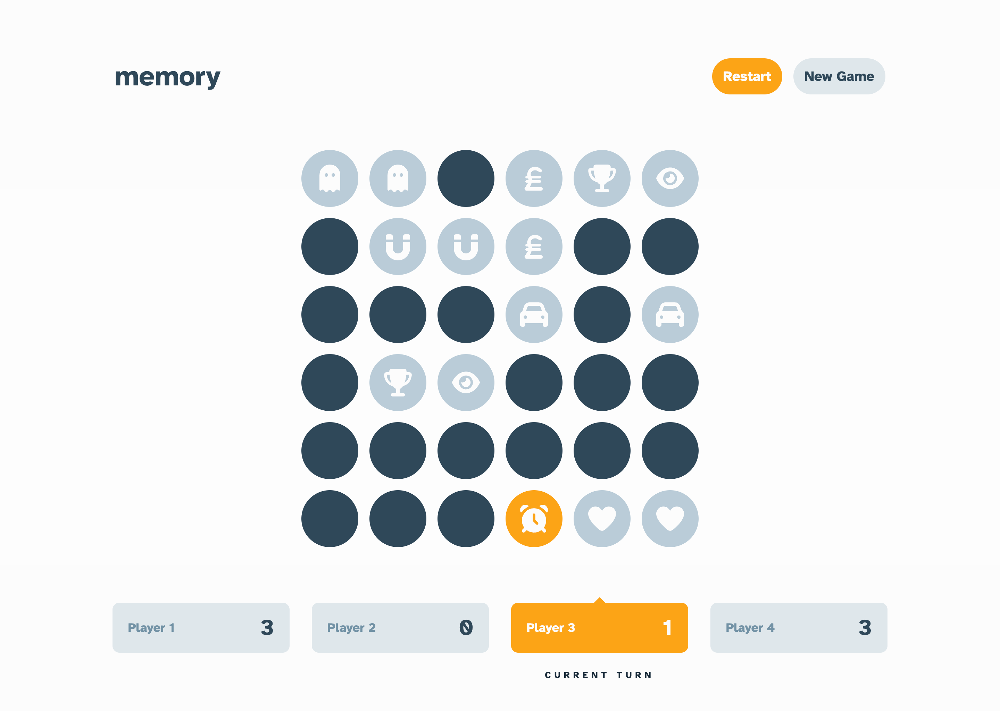
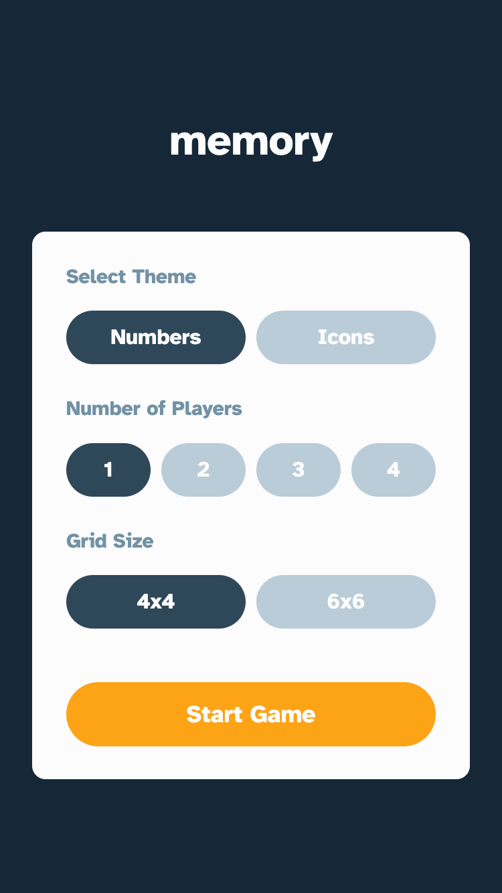
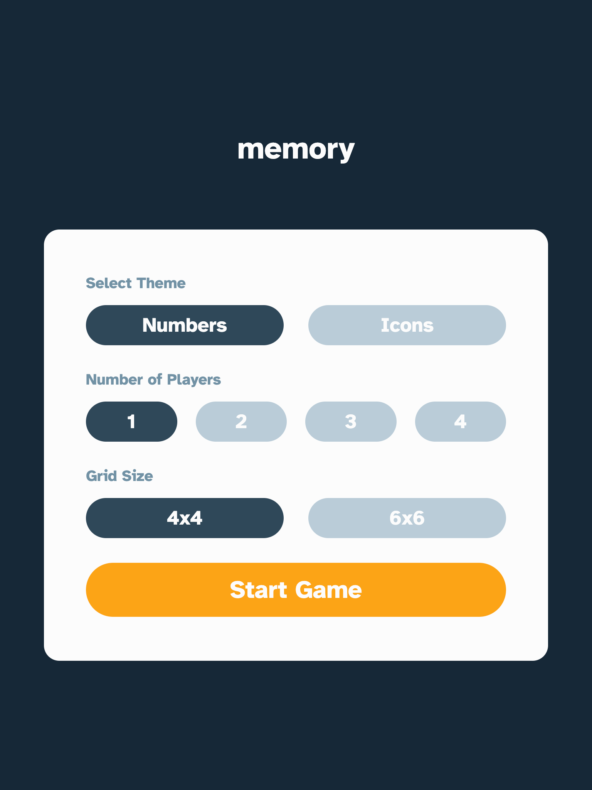
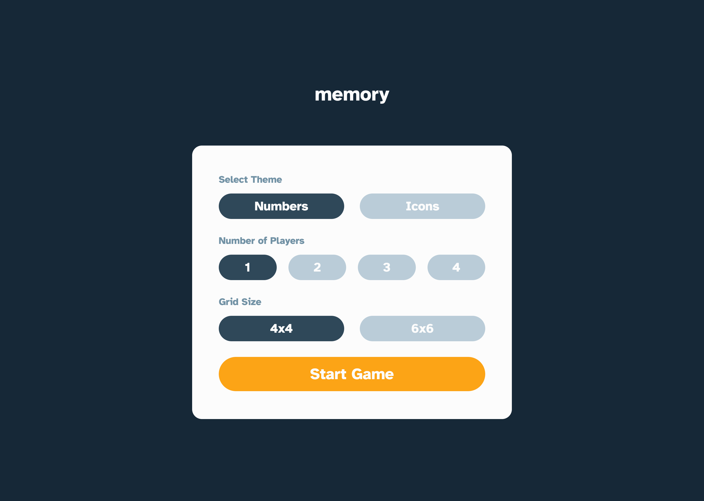
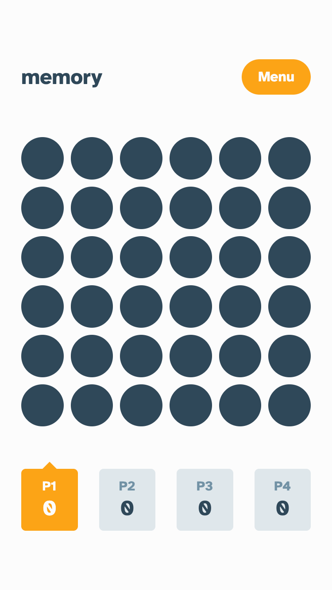
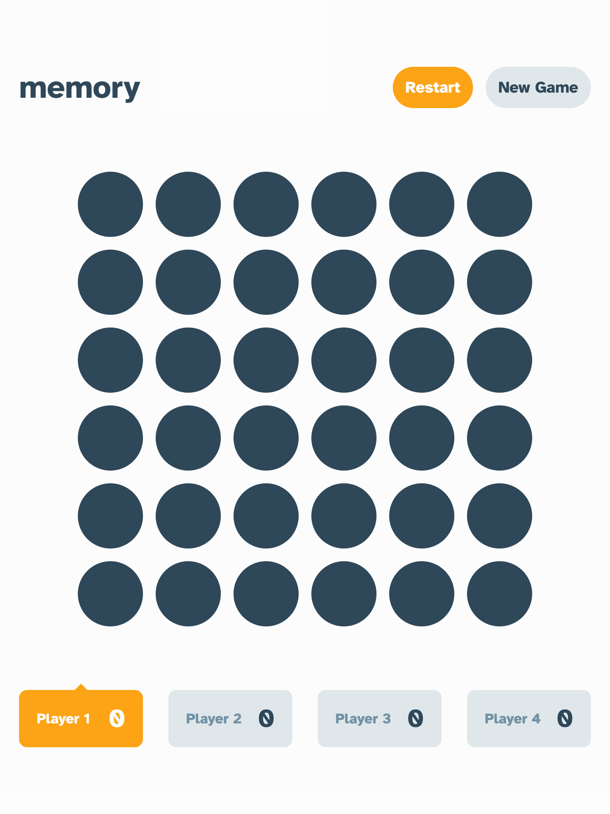
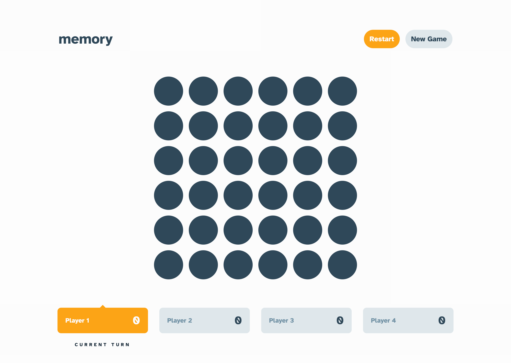
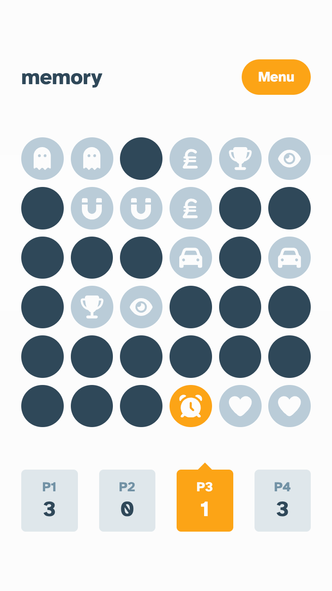
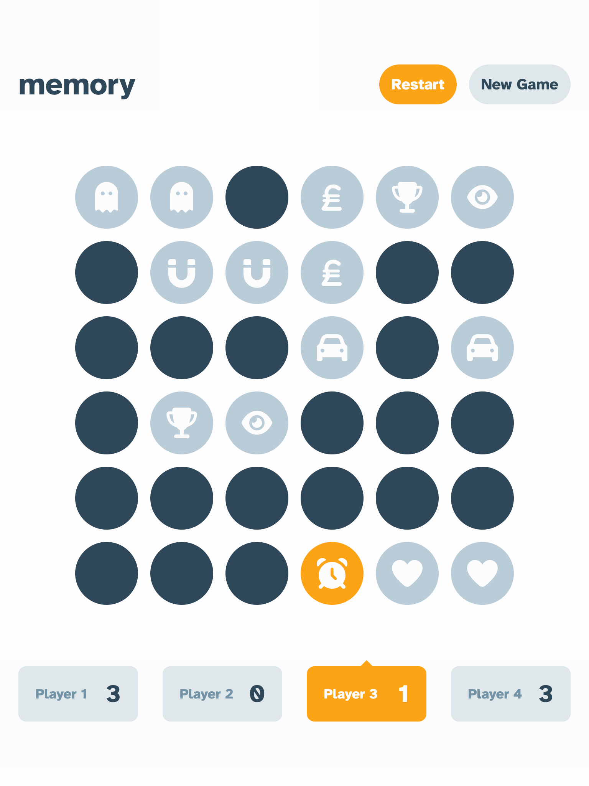
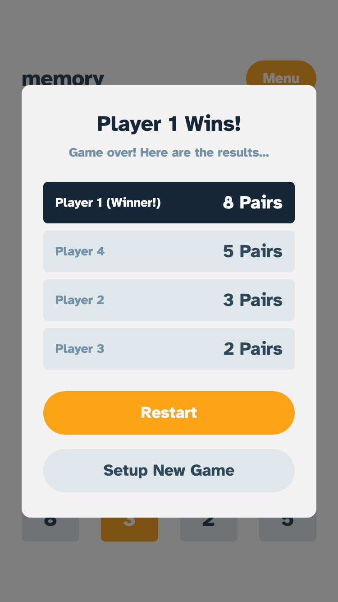

# Memory Game

A responsive memory-matching game built with Vue, Pinia, and Vue Router. The project was an opportunity to move beyond individual components and explore application state, routing, persistence, and more structured Vue application architecture.

**[Live Site](https://elisilk.github.io/memory-game/)** · **[Frontend Mentor Solution](https://www.frontendmentor.io/solutions/memory-game-implemented-with-vue-and-pinia-9hFdn-RHG3)**

## Overview

This project is a solution to the [Frontend Mentor Memory Game challenge](https://www.frontendmentor.io/challenges/memory-game-vse4WFPvM).

The challenge provides a complete visual design and interaction specification for a memory game that supports solo and multiplayer play, different grid sizes, and number or icon-based tiles. I used the project primarily as an opportunity to deepen my experience with Vue and Pinia and to learn Vue Router.

## Features

- Responsive layouts for mobile, tablet, and desktop
- Solo and multiplayer game modes
- 4×4 and 6×6 game grids
- Number and icon-based game themes
- Game state managed with Pinia
- Multiple application views managed with Vue Router
- Persistent best-game statistics using localStorage
- Responsive menu and game configuration controls
- Accessible labels and interactions
- Responsive handling of the game viewport and page background

## Built With

- Vue
- Pinia
- Vue Router
- Vite
- JavaScript
- Semantic HTML
- CSS custom properties
- CSS Grid and Flexbox
- localStorage
- GitHub Actions
- npm

## Technical Highlights

### Application State with Pinia

The project uses Pinia to manage state that needs to be shared across components, including game configuration, board state, player information, moves, and game progress.

Using a dedicated store helped separate game logic from individual UI components and provided a clearer structure for coordinating interactions across the application.

### Routing with Vue Router

This was one of my first projects where routing was an explicit part of the application architecture.

I used Vue Router to separate the game's different views and explored Vue Router's memory history mode for the deployed application.

### Persistent Game Statistics

The application stores best game statistics in localStorage so that players can retain their best results between sessions.

Implementing this required handling the relationship between the current game state, previously stored results, and newly completed games rather than simply writing and reading a single value.

### Responsive Game Interface

The game uses CSS Grid and responsive sizing to accommodate different board configurations and screen sizes.

I also had to account for differences in viewport behavior on mobile devices. Rather than relying entirely on the application's root container for the page background, the application updates the document background based on the active view.

### Component and Project Organization

The project uses a structured Vue component architecture and separates application concerns into reusable components, views, stores, and supporting modules.

I also use VS Code file nesting to keep related files grouped together in the project tree, making the structure easier to navigate.

## Development Workflow

The project uses npm for dependency management and Vite for development and production builds.

Deployment to GitHub Pages is automated with GitHub Actions. A push to the `main` branch installs dependencies with `npm ci`, builds the production application, uploads the resulting `dist` directory as a Pages artifact, and deploys it to GitHub Pages. The workflow can also be triggered manually from GitHub Actions.

The repository also includes project-level configuration for ESLint, Prettier, and VS Code, including file nesting to keep related files organized in the editor.

## Accessibility and Responsive Design

Accessibility was considered throughout the implementation, including semantic HTML, accessible labeling of interactive controls, and responsive behavior across different screen sizes.

The project also includes planned improvements around keyboard navigation of the game board and respecting `prefers-reduced-motion` for animations.

## Screenshots

|                     Mobile designed at 375px:                     |                     Tablet designed at 768px:                     | Desktop designed at 1440px:                                        |
| :---------------------------------------------------------------: | :---------------------------------------------------------------: | ------------------------------------------------------------------ |
|                |                |                |
|  |  |  |
|       |       |       |
|       |       |       |

## Continued Development

There are several areas I would consider revisiting in a future iteration:

- Improve keyboard navigation within the game board
- Add and refine transitions and tile-flip animations
- Respect `prefers-reduced-motion` when animations are introduced
- Further refine component reuse and shared UI components
- Expand the available icon set
- Continue refining responsive behavior and visual details

## What I Learned

This project helped me move from building primarily interface-focused projects toward thinking more explicitly about application architecture.

In particular, I gained experience with:

- Managing shared application state with Pinia
- Structuring a multi-view Vue application
- Working with Vue Router
- Persisting application data with localStorage
- Coordinating game state and user interactions
- Building responsive interfaces with CSS Grid
- Organizing a growing Vue codebase into components, views, and stores
- Using automated workflows for project deployment

## Credits

- [Frontend Mentor](https://www.frontendmentor.io/) for the original design and challenge
- [Vue](https://vuejs.org/)
- [Pinia](https://pinia.vuejs.org/)
- [Vue Router](https://router.vuejs.org/)
- [Vite](https://vite.dev/)

## Author

**Eli M. Silk**

- [GitHub](https://github.com/elisilk)
- [Frontend Mentor](https://www.frontendmentor.io/profile/elisilk)
