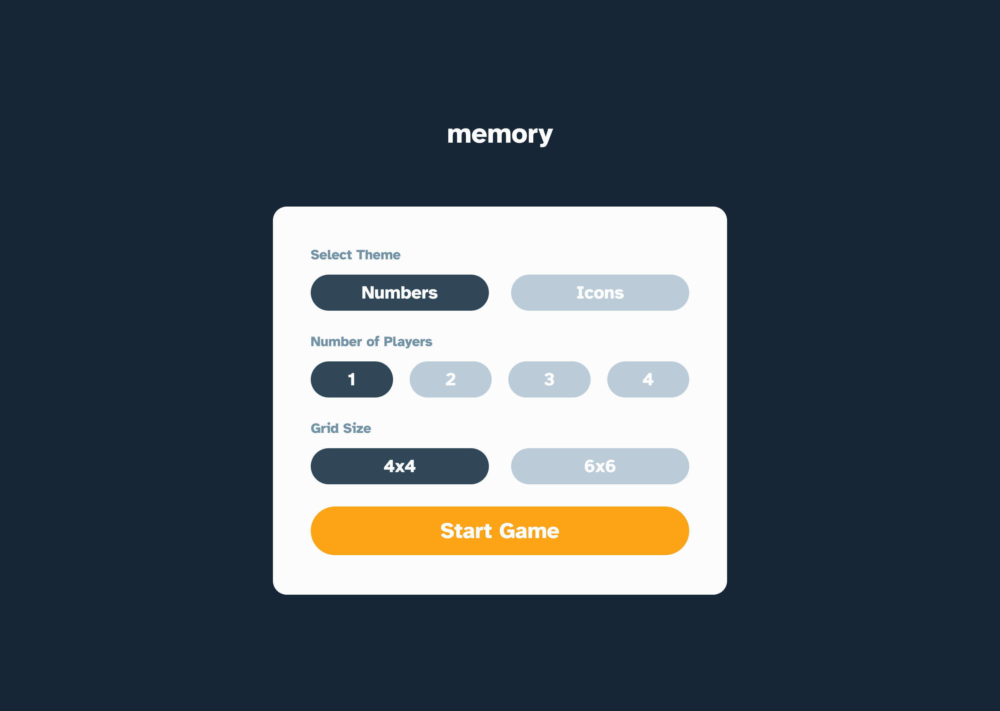

# Frontend Mentor - REST Countries API with color theme switcher solution

This is a solution to the [Memory game challenge on Frontend Mentor](https://www.frontendmentor.io/challenges/memory-game-vse4WFPvM). Frontend Mentor challenges help you improve your coding skills by building realistic projects.

I completed this challenge as part of the [JavaScript frameworks and libraries](https://www.frontendmentor.io/learning-paths/javascript-frameworks-and-libraries-JDWoqQjMyb) Frontend Mentor learning path. This continues my efforts to learn my chosen JS Framework - [Vue.js](https://vuejs.org/) + [Pinia](https://pinia.vuejs.org/). And now the goal is to specifically learn to work with routing.

## Table of contents

- [Overview](#overview)
  - [The challenge](#the-challenge)
  - [Screenshots](#screenshots)
  - [Links](#links)
- [My process](#my-process)
  - [Built with](#built-with)
  - [What I learned](#what-i-learned)
  - [Continued development](#continued-development)
  - [Useful resources](#useful-resources)
- [Author](#author)

## Overview

### The challenge

Users should be able to:

- View the optimal layout for the game depending on their device's screen size
- See hover states for all interactive elements on the page
- Play the Memory game either solo or multiplayer (up to 4 players)
- Set the theme to use numbers or icons within the tiles
- Choose to play on either a 6x6 or 4x4 grid

### Screenshots

|                     Mobile designed at 375px:                     |                    Tablet designed at 1440px:                     | Desktop designed at 1440px:                                        |
| :---------------------------------------------------------------: | :---------------------------------------------------------------: | ------------------------------------------------------------------ |
|                |                |                |
|  |  |  |

### Links

- Solution URL: [https://github.com/elisilk/memory-game](https://github.com/elisilk/memory-game)
- Live Site URL: [https://elisilk.github.io/memory-game/](https://elisilk.github.io/memory-game/)

## My process

### Built with

- Semantic HTML5 markup
- CSS custom properties
- Flexbox
- CSS Grid
- Mobile-first workflow
- Accessibility
- [Vite](https://vite.dev/)
- [Vue](https://vuejs.org/)
- [Pinia](https://pinia.vuejs.org/)
- [Vue Router](https://router.vuejs.org/)

### What I learned

As always, so many cool :sunglasses: things. Here are some of the key resources I used:

- File Structure and Naming
  - [Vue Style Guide](https://vuejs.org/style-guide/)
  - [How to Structure a Large Scale Vue.js Application](https://vueschool.io/articles/vuejs-tutorials/how-to-structure-a-large-scale-vue-js-application/)
- [Vue](https://vuejs.org/guide/)
  - [Vue.js Examples](https://vuejs.org/examples/#hello-world)
  - [Form Input Bindings](https://vuejs.org/guide/essentials/forms)
    - [Checkbox](https://vuejs.org/guide/essentials/forms#checkbox)
  - [Component v-model](https://vuejs.org/guide/components/v-model.html)
  - [Built-in Special Elements `<component>`](https://vuejs.org/api/built-in-special-elements#component)
  - [Template Refs](https://vuejs.org/guide/essentials/template-refs)
  - [Class and Style Bindings](https://vuejs.org/guide/essentials/class-and-style)
  - [Fallthrough Attributes](https://vuejs.org/guide/components/attrs)
- [Vue Router](https://router.vuejs.org/)
  - [Different History modes - Memory mode](https://router.vuejs.org/guide/essentials/history-mode.html#Memory-mode)
- [Build a custom media query composable for Vue apps](https://dev.to/unorthodev/build-a-custom-media-query-composable-for-vue-apps-1o2c) - This is super cool! Use the utility to produce a different menu for the mobile view versus the larger views.
- Icons
  - [Font Awesome Icons (solid, classic, free)](https://fontawesome.com/search?f=classic&s=solid&o=r)
  - [Making Semantic Icons Accessible](https://docs.fontawesome.com/web/dig-deeper/accessibility#making-semantic-icons-accessible)
  - [Bare SVGs on the Web](https://docs.fontawesome.com/web/add-icons/svg-bare)
  - [ARIA: img role](https://developer.mozilla.org/en-US/docs/Web/Accessibility/ARIA/Reference/Roles/img_role)
  - [ARIA: aria-labelledby attribute](https://developer.mozilla.org/en-US/docs/Web/Accessibility/ARIA/Reference/Attributes/aria-labelledby)
- Other one-off stuff
  - [Accessible SVGs](https://css-tricks.com/accessible-svgs/)
    - [SVG images and graphics require accessible text](https://dequeuniversity.com/rules/axe/4.2/svg-img-alt)
  - [Custom properties with defaults: 3+1 strategies](https://lea.verou.me/blog/2021/10/custom-properties-with-defaults/)
  - [Inclusively Hiding & Styling Checkboxes and Radio Buttons](https://www.sarasoueidan.com/blog/inclusively-hiding-and-styling-checkboxes-and-radio-buttons/)
  - [Equal Columns With Flexbox: It’s More Complicated Than You Might Think](https://css-tricks.com/equal-columns-with-flexbox-its-more-complicated-than-you-might-think/)
  - [Overriding Default Button Styles](https://css-tricks.com/overriding-default-button-styles/)
  - [CSS Triangle](https://css-tricks.com/snippets/css/css-triangle/)
- JavaScript
  - [How to clone an array in JavaScript](https://www.freecodecamp.org/news/how-to-clone-an-array-in-javascript-1d3183468f6a/)
  - [How to create an array containing 1...N](https://stackoverflow.com/questions/3746725/how-to-create-an-array-containing-1-n)
  - [How to randomize (shuffle) a JavaScript array?](https://stackoverflow.com/questions/2450954/how-to-randomize-shuffle-a-javascript-array)
- HTML Elements
  - [`<menu>`: The Menu element](https://developer.mozilla.org/en-US/docs/Web/HTML/Reference/Elements/menu)
  - [`<dialog>`: The Dialog element](https://developer.mozilla.org/en-US/docs/Web/HTML/Reference/Elements/dialog)
  - [`<input type="radio">`](https://developer.mozilla.org/en-US/docs/Web/HTML/Reference/Elements/input/radio)
  - [`<input type="checkbox">`](https://developer.mozilla.org/en-US/docs/Web/HTML/Reference/Elements/input/checkbox)

### Continued development

Specific areas that the solution should be improved (known issues):

- [x] The futbol and sun look too much alike. Replace one with a more distinctive alternative.
- [x] Clarify what the tiles with the orange background indicate
  - After some fumbling around, it seems the best and clearest design choice is to have both recently turned over tiles initially turn orange as part of the current move. If they are a pair, then they stay orange for a bit (or until the next move starts), and then turn to a light blue background. If they are not a pair, then they simply turn back over.
- [x] Make all the color values into semantic properties
- [ ] Make all the sizing/spacing values into semantic properties
- [ ] Make all the color values into semantic properties
- [ ] Better implement the fluid padding of the icons/numbers within the circular tile
- [ ] Consider including a much broader set of icons (currently there are 18 icons, which is just enough for the 6x6 games), so there is more variation in which ones are chosen for any individual game.
- [ ] Consider whether to make the default screen the solo player 4x4 grid, as that is the one used in the Frontend Mentor design screenshot and so will be used for the design comparison.
- [ ] Refactor the components around DRY principles to minimize repeated elements (e.g, the stat container vs. the footer stat container), and so that more specific versions of components build on and inherit an appropriate base component (e.g., the button base component)

Specific enhancements I'd like to make (feature requests):

- [x] Make it so that after a failed move (a pair was not found), that clicking on one of the turned over tiles immediately starts the next move (and turns over the tile not chosen), rather than waiting for the eval delay to finish. Currently, those two turned over tiles would be in an unplayable state, but can potentially change that.
- [ ] Navigate the tile grid with the arrow keys, and hit the return key to flip a tile over
- [ ] Add in transitions/animations
  - [ ] from one view to the next
  - [x] tiles flipping over and back
    - [Intro to CSS 3D transforms - Card Flip](https://3dtransforms.desandro.com/card-flip) - What a cool effect and an excellent explanation/walkthrough.
- [ ] Read in the icons programmatically rather than hard-coding a static list.
- [x] Have the icons list and their associated components be handled in one place so there is just one source of truth. Solved by using [Async Components](https://vuejs.org/guide/components/async).
- [ ] Save to local storage the best all-time statistics for number of moves and time elapsed (for that device) and display them in the results, especially if they get bested

More general ideas I want to consider:

Hmm 🤔 ...

- [ ] Read and incorporate the Vue [Style Guide](https://vuejs.org/style-guide/) into the application
- [ ] Finish watching and learning from Vue School's [Vue Router 4 for Everyone: Master Routing in Vue.js](https://vueschool.io/courses/vue-router-4-for-everyone) course

### Useful resources

- [Vue Guide](https://vuejs.org/guide/)
- [Pinia Guide](https://pinia.vuejs.org/core-concepts/)
- [Vite Guide](https://vite.dev/guide/)
- [MDN Web Docs for CSS](https://developer.mozilla.org/en-US/docs/Web/CSS) - Went here a lot to reference the different CSS properties and the shorthands, and all the great explanations about best practices.

## Author

- Website - [Eli Silk](https://github.com/elisilk)
- Frontend Mentor - [@elisilk](https://www.frontendmentor.io/profile/elisilk)
